# 06Lab - System modelling, a Programming Language approach: non-determinism, unbounded size, Petri Nets

## Task 1: VERIFIER

Code and do some analysis on the Readers & Writers Petri Net. Add a test to check that in no path long at most 100 
states mutual exclusion fails (no more than 1 writer, and no readers and writers together). Can you extract a small API 
for representing safety properties? What other properties can be extracted? How the boundness assumption can help?

### Work Done:

The tasks asked for the implementation of a Petri Net regarding the Writers & Readers implementation in the slides, which
has been done in the class [PNReadersWriters.scala](src/main/scala/u06/examples/task1/PNReadersWriters.scala), where
the places enumerated are:
```scala 3
enum Place:
    case ProcessIdle, ProcessReady, ReaderReady, WriterReady, ReaderRunning, WriterRunning
```

And the DSL-like specs for building transitions is:
```scala 3
def pnRW = PetriNet[Place](
    MSet(ProcessIdle) ~~> MSet(ProcessReady),

    MSet(ProcessReady) ~~> MSet(WriterReady),
    MSet(ProcessReady) ~~> MSet(ReaderReady),

    // The rule below is set to guarantee mutex from Readers
    MSet(ReaderReady) ~~> MSet(ReaderRunning) ^^^ MSet(WriterRunning),
    MSet(ReaderRunning) ~~> MSet(ProcessIdle),

    // This one instead to guarantee mutex from Writers, AND to have only 1 writer at a time
    MSet(WriterReady) ~~> MSet(WriterRunning) ^^^ MSet(WriterRunning, ReaderRunning),
    MSet(WriterRunning) ~~> MSet(ProcessIdle),
  ).toSystem
```
When it comes to the safety (& others) properties that are asked to be implemented and tested, they are implemented in
the [PNSafetyProperties.scala](src/main/scala/u06/examples/task1/PNSafetyProperties.scala) class, and used in the
previously mentioned PNReadersWriters class and also in the test class 
[PNReadersWritersTask1Test.scala](src/test/scala/u06/task1/PNReadersWritersTask1Test.scala). The properties that are 
checked for are:
* **Mutual Exclusion** (Mutex), in order to make sure that there are no processes that are simultaneously Reading *AND*
Writing at the same time;
* **Boundedness**, which check and verifies that the number of tokens in each place of the PN does not go over a certain
boundary (in the file executed it's set to 10).

Again referencing the first scala class, the implementation verifies the properties of Mutex and Boundedness for the 
newly PN model of Reader & Writers. The main abstraction that guarantees a better separation of implementations, is the
usage of generic case class for each ```"isVerified"``` property, that can be extended to check even more different
properties.

## Task 2: DESIGNER

Code and do some analysis on a variation of the Readers & Writers Petri Net: it should be the minimal variation you can 
think of, such that if a process says it wants to read, it eventually (surely) does so. How would you show evidence 
that your design is right? What about a variation where at most two process can write?

### Work Done:

As asked per the task, I reused the PN developed during the first task, and by doing very minimal changes I added a
property to make sure that, if a process wants to read, eventually it will. This can very much be represented 
through the liveness property which is usually present in concurrency systems.

Once again, the property has been added to the 
[PNSafetyProperties.scala](src/main/scala/u06/examples/task1/PNSafetyProperties.scala), amongst all the others already
implemented in the following way:
```scala 3
// Task 2
case class ReadersWritersLiveness[P](waitPlace: P, goalPlace: P) extends PNSafetyProperties[MSet[P]]:
  def isViolated(marking: MSet[P]): Boolean =
    marking(waitPlace) > 0 && marking(goalPlace) == 0
```
And it has been tested in the file
[PNReadersWritersTask2Test.scala](src/test/scala/u06/task2/PNReadersWritersTask2Test.scala), where, by changing one line,
instead of checking the boundedness property from the previous task, it now checks for the liveness on, using the same
structure used before to test and make sure the properties have been verified in paths that are, at most, not longer
than 100 states.

## Task 3: ARTIST

Create a variation/extension of PetriNet meta-model, with priorities: each transition is given a numerical priority,
and no transition can fire if one with higher priority can fire. Show an example that your pretty new “abstraction”
works as expected. Another interesting extension is “coloring”: tokens have a value attached, and this is read/updated
by transitions.

### Work Done:

To implement the work asked by the task, I created two extensions to the normal Petri Net model, one for the priority
system, and on for the coloring system. The first one is implemented in the file
[PetriNetPriority.scala](src/main/scala/u06/task3/PetriNetPriority.scala), meanwhile the second one is in the file
[ColouredPetriNet.scala](src/main/scala/u06/task3/ColouredPetriNet.scala) that extends
[ColouredToken.scala](src/main/scala/u06/task3/ColouredToken.scala).

#### **Priority System**

As it can be seen in the file, there has been an extensione of the base Petri Net class, which now has a priority as per
the Trn class. As also stated in the task, the priority is a numerical value, and when the transitions are fired, it is
given priority to the one with the highest value, therefore letting the user design a net where certain processes have
higher priority over others, which is done by ordering the transitions by their priority value, in descending order.

This has been tested in the file [PetriNetsPriorityTest.scala](src/test/scala/u06/task3/PetriNetsPriorityTest.scala),
where the example assumes that a PN exists wth 3 Places, and 2 transitions, where the first transition has a higher 
priority than the other. When, as tested towards the end of the file, the transition with the higher priority is fired, 
meanwhile the other is not.

#### **Coloring System**

A Colored Petri Net, or CPN, is a type of Petri net where tokens have "colors" (which can be thought of as data,
for example a simple integer value) that can be used to represent different types of tokens. Although the data can be of
arbitrarily complex types, places in CPN contain tokens of a single type.

Firstly the case class ```ColouredToken``` is defined, which represents a token with a color and a value.
The color is represented as a generic type, to include any type of data to be transported by the token, to let also
implement better a PN class to interact with these values.

Lastly then ```ColouredPetriNet``` is the class that extends the base Petri Net class, and it is used to create a 
colored Petri net, which contains as usual places and transitions, but also the colored tokens.

This instead has been tested in the file 
[ColouredPetriNetsTest.scala](src/test/scala/u06/task3/ColouredPetriNetsTest.scala), and as we can see, there's
multiple transitions that are composed of multiple places, and the tokens are colored with different values. The test
tries to fire a transition coming from the initial place defined, with a certain value to it, which then in execution
transits to the correct place.

## Task 4: TOOLER

The current API might be re-organised: can we generate/navigate all paths thanks to caching and lazy evaluation? Can 
we use monads/effects to capture non-determinism? Can we generate paths and capture safety properties by ScalaCheck?

### Work Done:

The implementation of the Cache and Lazy evaluation has been done in the files 
[CachedSystem.scala](src/main/scala/u06/task4/CachedSystem.scala) and 
[LazySystem.scala](src/main/scala/u06/task4/LazySystem.scala), which are then tested inside the file 
[PNExample.scala](src/main/scala/u06/task4/PNExample.scala).

### `CachedSystem` Class

The `CachedSystem` class is designed to add caching functionality to an existing `System`. This means that it stores the results of previous computations to avoid redundant calculations.

#### Key Points:
1. **Constructor**: It takes an existing `System` as a parameter.
2. **Cache**: It uses a mutable map to store the results of the `next` method for different states.
3. **Override `next` Method**: The `next` method checks if the result for a given state is already in the cache. If it is, it returns the cached result. If not, it computes the result using the underlying system, stores it in the cache, and then returns it.

```scala
package scala.u06.task4

import scala.collection.mutable
import u06.modelling.System

class CachedSystem[S](system: System[S]) extends System[S] {
  private val cache = mutable.Map[S, Set[S]]()

  override def next(a: S): Set[S] = {
    cache.getOrElseUpdate(a, system.next(a))
  }
}
```

### `LazySystem` Class

The `LazySystem` class is designed to add lazy evaluation functionality to an existing `System`. This means that it defers the computation of transitions until they are actually needed.

#### Key Points:
1. **Constructor**: It takes an existing `System` as a parameter.
2. **Lazy Cache**: It uses a mutable map to store functions that compute the results of the `next` method for different states.
3. **Override `next` Method**: The `next` method checks if a function for computing the result for a given state is already in the lazy cache. If it is, it calls the function to get the result. If not, it creates a function that computes the result using the underlying system, stores this function in the lazy cache, and then calls the function to get the result.

```scala
package scala.u06.task4

import u06.modelling.System
import scala.collection.mutable

class LazySystem[S](system: System[S]) extends System[S] {
  private val lazyCache = mutable.Map[S, () => Set[S]]()

  override def next(a: S): Set[S] = {
    lazyCache.getOrElseUpdate(a, () => system.next(a))()
  }
}
```

## Task 5: PETRINET-LLM

We know that LLMs/ChatGPT can arguably help in write/improve/complete/implement/reverse-engineer standard ProgLangs. 
But is it of help in designing Petri Nets? Does it truly “understand” the model? Does it understand our DSL by examples?

### Work Done:

Just like with previous LLMs testing task in previous labs, I tested the ChatGPT LLM to help write, improve, complete,
implement and/or reverse-engineer standard ProgLangs to help design Petri Nets, and I also tested CoPilot and Llama on 
my own out of curiosity, but not reporting the findings, since they were not as good as GPT.

For all the tasks, I used, as previously stated, the available `Search` and `Reason` functionalities made available from
OpenAI with GPT to perform all of these tasks.

* **write**: I've given GPT a prompt including a couple of files so he's know how to move around the custom lab DSL of the
Petri Nets, and the prompt was as follows:

```
Hello, I need help with a task, could you pretty pretty please help me with writing the code for an example Petri Net, with a custom Scala DSL designed to model Petri nets. The code I need to write, needs to be just about building the Net.
The code related to how the custom Petri Net DSL was created is as follows:

"
... Inside here the PetriNet.scala file is contained
", meanwhile the code with an example using the previously mentioned code is as follows:

"
... Inside here the SystemChannel.scala file is contained
"
```

The result given is actually pretty good, the Net is modelled correctly, and seems to understand it. Now, the LLM also
produced a sort of runnable example also, which unfortunately does not work, simply because it relies on code that does
not exist, mainly the ```val reachable = pnProducerConsumer.reachableFrom(initial, 5)``` in the main. The code produced
is as follows:

```scala 3
package scala.u06.task5.write

import u06.utils.MSet
import u06.modelling.PetriNet
import u06.modelling.SystemAnalysis

object PNProducerConsumer:
  // Define the control places of the Petri Net
  enum Place:
    case Empty, Full

  // Bring the enum values and DSL into scope
  export Place.*
  export u06.modelling.PetriNet.*
  export u06.modelling.SystemAnalysis.*
  export u06.utils.MSet

  // DSL-like specification of a simple producer-consumer Petri Net
  def pnProducerConsumer = PetriNet[Place](
    // Producer: when buffer is Empty, produce a token (add Full)
    MSet(Empty) ~~> MSet(Full),
    // Consumer: when buffer is Full, consume a token (remove Full, return to Empty)
    MSet(Full)  ~~> MSet(Empty)
  ).toSystem

  @main def mainPNProducerConsumer() =
    import PNProducerConsumer.*
    // Starting marking: buffer empty
    val initial = MSet(Empty)
    // Compute all reachable markings up to 5 steps
    val reachable = pnProducerConsumer.reachableFrom(initial, 5)
    println("Reachable markings in up to 5 steps:")
    reachable.toList.foreach(m => println(m.toList))
```

Overall the produced code is pretty good, considering the prompt and the material given.

* **improve**: GPT produced a version of the Petri Net that tries to improve on the original modelling, unfortunately,
after several different tries, and even with prompt engineering, the code still presents semantics errors which makes
the code non-usable out of the box, it is though a good starting point in case somebody wants to expand a feature. The
prompt I used was the following:
```
Hello, I need help with a task, could you pretty pretty please help me improving an already existing Petri Net, written 
with a custom Scala DSL designed to model Petri nets. The overall idea is to implement other operations that could be
useful to mimicry other characteristics of the Petri Net that I haven't captured.
The code related to how the custom Petri Net DSL was created is as follows:
"
... Inside here is the PetriNet.scala file
", meanwhile the code with an example using the previously mentioned code is as follows:
"
... Inside here is the SystemChannel.scala file
"
```

Meanwhile the code produced is as follows:

```scala 3
// Extended PetriNet DSL with additional analysis operations

package u06.modelling

import u06.utils.MSet
import scala.collection.immutable.{Set, Map}

object PetriNet {
  // Basic types
  case class Trn[P](cond: MSet[P], eff: MSet[P], inh: MSet[P])
  type PetriNet[P] = Set[Trn[P]]
  type Marking[P] = MSet[P]

  // Factory
  def apply[P](transitions: Trn[P]*): PetriNet[P] = transitions.toSet

  // Core semantics
  extension [P](pn: PetriNet[P]) {
    def toSystem: System[Marking[P]] = m =>
      for {
        Trn(cond, eff, inh) <- pn
        if m disjoined inh
        out                 <- m extract cond
      } yield out union eff

    def toCachedSystem: System[Marking[P]] = new CachedSystem(toSystem)
    def toLazySystem:  System[Marking[P]] = new LazySystem(toSystem)
  }

  // DSL syntax
  extension [P](m: Marking[P]) def ~~> (eff: Marking[P]) = Trn(m, eff, MSet.empty)
  extension [P](t: Trn[P])     def ^^^ (inh: Marking[P]) = t.copy(inh = inh)

  // ###########################################
  // New: firing semantics and reachability
  // ###########################################

  /**
   * One-step firing: returns all successors of a given marking
   */
  extension [P](pn: PetriNet[P])
    def fireOnce(m: Marking[P]): Set[Marking[P]] = 
      toSystem(m).toSet

  /**
   * Reachability graph up to depth n
   */
  extension [P](pn: PetriNet[P])
    def reachableFrom(initial: Marking[P], depth: Int): Set[Marking[P]] = {
      def loop(current: Set[Marking[P]], visited: Set[Marking[P]], k: Int): Set[Marking[P]] =
        if k == 0 then visited
        else {
          val next = current.flatMap(pn.fireOnce) -- visited
          loop(next, visited ++ next, k - 1)
        }
      loop(Set(initial), Set(initial), depth)
    }

  /**
   * Deadlock detection: has no outgoing transitions
   */
  extension [P](pn: PetriNet[P])
    def isDeadlock(m: Marking[P]): Boolean = pn.fireOnce(m).isEmpty

  /**
   * All dead markings reachable within depth n
   */
  extension [P](pn: PetriNet[P])
    def deadlocksFrom(initial: Marking[P], depth: Int): Set[Marking[P]] =
      reachableFrom(initial, depth).filter(isDeadlock)

  // TODO: Add invariant computation, place capacities, timed transitions, and bisimulation checks
}
```

* **complete/implement**: For completing an already existing piece of code, I used the prompt:

```
Hello, I need help with a task, could you pretty pretty please help me complete an already basic existing implementation of a Scala Petri Net, written with a custom Scala DSL designed to model Petri nets. The overall idea is to implement the rest of the code so a Petri Net can be modeled and tested through firing
The code related to how the basic custom Petri Net DSL was created is as follows:
"
object PetriNet:
// pre-conditions, effects, inhibition
case class Trn\[P] (cond: MSet\[P], eff: MSet\[P], inh: MSet\[P])
type PetriNet\[P] = Set\[Trn\[P]]
type Marking\[P] = MSet\[P]
", meanwhile this is the code for the MSet:
"
... Inside here the MSet.scala file is present
"
```

Where the main idea was to see if GPT was able to complete the rest of the Petri Net, giving the one present in the lab
as a basis for it, considering that the code produced, was actually not that bad, and is as follows:
```scala 3
package scala.u06.task5.completeImplement

import u06.utils.MSet

object PetriNet:
  // pre-conditions, effects, inhibition
  case class Trn[P](cond: MSet[P], eff: MSet[P], inh: MSet[P])
  type PetriNet[P] = Set[Trn[P]]
  type Marking[P] = MSet[P]

  /**
   * Returns true if the transition t is enabled under marking m:
   * - all tokens in cond are in m
   * - no tokens in inh are in m
   */
  def enabled[P](net: PetriNet[P], m: Marking[P], t: Trn[P]): Boolean =
    m.matches(t.cond) && t.inh.disjoined(m)

  /**
   * Returns all enabled transitions under marking m
   */
  def enabledTransitions[P](net: PetriNet[P], m: Marking[P]): Set[Trn[P]] =
    net.filter(t => enabled(net, m, t))

  /**
   * Attempts to fire transition t on marking m:
   * - if enabled, returns Some(newMarking)
   * - else None
   * Effects: newMarking = (m \ cond) \* diff cond then union eff
   */
  def fire[P](m: Marking[P], t: Trn[P]): Option[Marking[P]] =
    if enabled(net = Set.empty, m = m, t = t) then
      val removed = m.diff(t.cond)
      val added   = removed.union(t.eff)
      Some(added)
    else None

  /**
   * Fires any one enabled transition nondeterministically
   */
  def fireOne[P](net: PetriNet[P], m: Marking[P]): Option[(Trn[P], Marking[P])] =
    enabledTransitions(net, m).headOption.flatMap { t =>
      fire(m, t).map(m2 => (t, m2))
    }

  /**
   * Computes the reachable markings in at most "steps" steps
   */
  def reachable[P](net: PetriNet[P], m0: Marking[P], steps: Int): Set[Marking[P]] =
    def rec(current: Set[Marking[P]], depth: Int): Set[Marking[P]] =
      if depth == 0 then current
      else
        val next = for
          m <- current
          t <- enabledTransitions(net, m)
          m2 <- fire(m, t)
        yield m2
        current ++ rec(next, depth - 1)
    rec(Set(m0), steps)

// Example usage:
import PetriNet._

@main def testPetri(): Unit =
  // Define places as symbols
  type Place = String
  val p = MSet.ofList[Place](List("p1", "p2"))

  // Transition t1: consumes p1, produces p2
  val t1 = Trn(cond = MSet("p1"), eff = MSet("p2"), inh = MSet())
  val net: PetriNet[Place] = Set(t1)
  val initial: Marking[Place] = MSet("p1", "p1")

  println(s"Enabled: ${enabledTransitions(net, initial)}")
  fireOne(net, initial) match
    case Some((t, m2)) => println(s"Fired $t -> $m2")
    case None          => println("No transition enabled")
  println(s"Reachable in 3 steps: ${reachable(net, initial, 3)}")

```

Not only GPT presented a functioning file from the get-go, the rest of the methods produced actually offer a very good
implementation of what the Petri Net could have been given.

* **reverse-engineer**: Finally, for reverse-engineering, I used the SystemChannel code to see if the LLM would've been
able to implement what the Petri Net could be/have been, therefore the prompt given was as follows:

```
Hello, I need help with a task, could you pretty pretty please help me reverse-engineer an usage of a Petrin Net in 
Scala, to produce a basic implementation of a Scala Petri Net, written with a custom Scala DSL designed to model Petri 
nets. The overall idea is to implement the rest of the code so a Petri Net can be modeled and tested through firing, by 
reverse-engineering the usage.
The code related to how the custom Petri Net DSL that fires was created is as follows:
"
... Inside here is the SystemChannel.scala file
"
```
It did take a few tries, and the only somewhat viable code that GPT could produce was as follows:
```scala 3
// Package for modeling systems as Petri nets
package scala.u06.task5.reverseEngineer

// Core System type
case class System[T](
                      transitions: Set[(T, T)]
                    ) {
  // Return direct successors of a given state
  def next(from: T): Set[T] =
    transitions.collect { case (s, t) if s == from => t }

  // Normalize a state by walking until a terminal state (no outgoing transitions)
  def normalForm(start: T): T = {
    @annotation.tailrec
    def loop(current: T): T =
      next(current).headOption match {
        case Some(nextState) => loop(nextState)
        case None            => current
      }
    loop(start)
  }

  // All paths of exactly 'depth' transitions starting from 'start'
  def paths(start: T, depth: Int): Iterable[List[T]] = {
    def loop(current: T, steps: Int): Iterable[List[T]] =
      if (steps == 0) Iterable(List(current))
      else
        next(current).flatMap { succ =>
          loop(succ, steps - 1).map(current :: _)
        }
    loop(start, depth)
  }

  // All paths up to a maximum depth
  def completePathsUpToDepth(start: T, maxDepth: Int): Iterable[List[T]] =
    (0 to maxDepth).flatMap(paths(start, _))
}

object System {
  // Construct a System from a variable number of transitions
  def ofTransitions[T](trs: (T, T)*): System[T] =
    System(trs.toSet)
}

// Analysis utilities
object SystemAnalysis {
  extension[T] (sys: System[T]) {
    def next(from: T): Set[T]       = sys.next(from)
    def normalForm(start: T): T     = sys.normalForm(start)
    def paths(start: T, d: Int): Iterable[List[T]] = sys.paths(start, d)
    def completePathsUpToDepth(start: T, d: Int): Iterable[List[T]] = sys.completePathsUpToDepth(start, d)
  }
}
```

It's not exactly as we what previously created for the lab, but it's still an interesting take on what the Petri Net
modelling could have been.

#### Final Thoughts:

GPT can definitely be used to produce usable results even for custom-made DSLs, that use "external knowledge", in our
case the fact that the LLM knows in theory what Petri Nets are, but it showed promise, with definitely hiccups, in 
applying that knowledge to more practical applications.


# 07Lab - Stochastic modelling: uncertainty, probability and frequencies


## Task 1: SIMULATOR
Take the communication channel CTMC example in StochasticChannelSimulation. Compute the average time at which 
communication is done—across n runs. Compute the relative amount of time (0% to 100%) that the system is in fail state 
until communication is done—across n runs. Extract an API for nicely performing similar checks.

### Work Done:

The goal is to compute key metrics related to the system's behavior and provide a reusable API for performing similar 
analyses on other CTMC models. Specifically, the following tasks have been accomplished:

1. **Compute the Average Time to Completion**: Calculate the average time at which the communication process reaches the 
*DONE* state across *n* simulation runs.
2. **Compute the Relative Time in the FAIL State**: Determine the percentage of time the system spends in the *FAIL* state 
relative to the total time until the communication process reaches the DONE state, averaged across *n* simulation runs.
3. **Extract a Reusable API**: Develop a generic and extensible API (SimulationAnalysis) to perform similar checks on any 
CTMC model, decoupling the analysis logic from the specific StochasticChannel example.
<hr></hr>

#### Key Components

**Simulation Analysis API**

The SimulationAnalysis object provides a reusable API for analyzing CTMC simulations. It includes:


* **averageTimeToState**: Computes the average time to reach a specific state (e.g., DONE) across multiple simulation runs.
* **relativeTimeInState**: Computes the relative time spent in a specific state (e.g., FAIL) until another state (e.g., DONE) is reached, averaged across multiple runs.
The API is designed to be generic, allowing it to work with any CTMC model by accepting a trace generator function as input.

<hr></hr>

#### Implementation Details

**1. Average Time to Completion**

The *averageTimeToState* method calculates the average time at which the system reaches a target state (_endState_) 
across _n_ runs. It works as follows:

* For each run, the simulation trace is generated starting from the initial state.
* The method identifies the first event where the system reaches the target state and records the time.
* The average time is computed by summing the recorded times and dividing by the number of runs.

**2. Relative Time in the _FAIL_ State**
   
The _relativeTimeInState_ method calculates the percentage of time the system spends in a specific state (_targetState_) 
relative to the total time until another state (_endState_) is reached. It works as follows:

* For each run, the simulation trace is generated starting from the initial state.
* The method calculates the total time and the time spent in the target state by iterating over the trace.
* The ratio of the target time to the total time is computed for each run, and the average ratio is returned.

**3. Reusable API**
   
The _SimulationAnalysis_ API is implemented with modularity and reusability in mind:

* A helper method, _runSimulations_, encapsulates the logic for running multiple simulations and processing their traces.
* The analysis methods (_averageTimeToState_ and _relativeTimeInState_) are concise and focus on their specific 
computations, delegating common tasks to the helper method.

## Task 2: GURU
Check the SPN module, that incorporates the ability of CTMC modelling on top of Petri Nets, leading to Stochastic 
Petri Nets. Code and simulate Stochastic Readers & Writers shown in previous lesson. Try to study how key 
parameters/rate influence average time the system is in read or write state.

### Work Done:

**Stochastic Petri Nets (SPN)**

SPNs extend Petri Nets by associating stochastic rates with transitions. These rates define the probability of a 
transition firing over time, enabling the modeling of systems with probabilistic behavior. SPNs are particularly useful 
for performance analysis and reliability studies. The work done can be seen in the file 
[StochasticReadersWriters.scala](src/main/scala/u07/task2/StochasticReadersWriters.scala).

**Continuous-Time Markov Chains (CTMC)**

SPNs are mapped to CTMCs, where:

* States correspond to markings (token distributions) in the Petri Net.
* Transitions correspond to state changes with associated rates.

#### **Key Components**

_**PNReadersWriters**_

This module implements a Petri Net for the Readers-Writers problem, ensuring:

* Mutual Exclusion: Readers and writers cannot access the shared resource simultaneously.

**_StochasticReadersWriters_**

This module extends the Readers-Writers problem to a _Stochastic Petri Net_ by:

* Assigning stochastic rates to transitions.
* Simulating the system using CTMCs to analyze its behavior over time.

Key features include:

* **Transition Rates**: Rates are defined as functions of the current marking, allowing dynamic behavior.
* **CTMC Simulation**: The SPN is converted to a CTMC, and simulation traces are generated to study the system's evolution.

**Simulation and Analysis**

The project provides tools to:

1. Simulate the Readers-Writers problem using both deterministic and stochastic models.
2. Analyze the impact of transition rates on the system's performance, such as:
   * Average time spent in the read or write state. 
   * Frequency of state transitions. 
3. Detect violations of mutual exclusion or boundedness in the deterministic model.


#### **Key Insights**

**Stochastic Model**

* Adds probabilistic behavior to the system.
* Allows studying the impact of transition rates on system performance.
* Provides insights into the average time spent in different states.

// TODO Add information related to running several tests to gather average speed

## Task 3: CHEMIST
SPNs can be used to simulate dynamics of chemical reactions. Experiment with it. E.g.: search the “Brussellator” 
chemical reaction on wikipedia: it oscillates! Try to reproduce it.

### Work Done:

#### **SPN Simulation of the Brusselator Chemical Reaction**

The SPNs can be used to simulate the dynamics of chemical reactions, and in this example, we model the 
classic `Brusselator`, a chemical oscillator, using the availabel SPN framework in the project lab. The Brusselator 
exhibits oscillatory behavior under certain parameter regimes, and this simulation demonstrates how to capture such 
dynamics using a stochastic approach.

**Overview**

The Brusselator is described by a set of chemical reactions that can be formulated as:

1. **Injection:** <br> 
∅ → X <br>
Produces species X at a constant rate.


2. **Degradation:** <br>
X → ∅ <br>
Degrades species X at a rate proportional to its current number.


3. **Autocatalytic Reaction:** <br>
2X + Y → 3X <br>
Uses 2 tokens of X and 1 token of Y to produce 3 tokens of X. This reaction converts a Y into an additional X (net 
effect), and is responsible for non-linear dynamics (oscillations).


4. **Conversion Reaction:** <br>
X → Y <br>
Converts species X into species Y at a rate proportional to the available X.

This simulation represents each reaction as an SPN transition. The transitions are defined by a condition (the tokens 
or reactants required), a rate function (using mass-action kinetics), an effect (the tokens added or produced), and an 
optional inhibition set (not used for these reactions).

The SPN is then converted to a Continuous-Time Markov Chain (CTMC) which allows us to simulate the stochastic dynamics 
of the system.

Additionally, in many stochastic formulations A and B are treated as constant parameters that define the external 
feed and conversion rate. One can usually either assume A and B are “external” (i.e. not represented as tokens) or 
introduce tokens that remain constant. For simplicity, I included only the dynamic species X and Y in the net.

#### **Code Structure**

##### **Modeling the Brusselator**
1. Defining the Species <br>
   We define an enumeration to represent the two species in the Brusselator:

```scala 3
enum Species:
   case X, Y
```

2. Creating the Transitions <br>
Each reaction of the Brusselator is implemented as an SPN transition:

   * **Injection of X:** <br>
   No prerequisites, constant rate A.

   * **Degradation of X:** <br>
   Requires one token of X. The rate is proportional to the number of X tokens.

   * **Autocatalytic Reaction:** <br>
   Requires two tokens of X and one token of Y. Its rate is proportional to the combinatorial factor (choosing 2 X’s) 
   times the number of Y tokens. After firing, it produces three tokens of X (resulting in a net addition of one X as 
   one Y is consumed).
   
   * **Conversion Reaction:** <br>
   Requires one token of X and converts it to one token of Y, with the rate proportional to the number of X tokens.

A sketch of the transition definitions is as follows:

```scala 3
   // Choose your rate constants
   val A  = 1.0    // constant injection of X
   val k2 = 1.0    // degradation rate for X
   val k3 = 1.0    // rate constant for the autocatalytic step
   val B  = 3.0    // conversion rate from X to Y
   
   // Transition definitions:
   
   // 1. Injection: ∅ → X
   val injectX = Trn[Species](
   cond = MSet(),                
   rate = _ => A,                
   eff  = MSet(Species.X),       
   inh  = MSet()                
   )
   
   // 2. Degradation: X → ∅
   val degradeX = Trn[Species](
   cond = MSet(Species.X),      
   rate = m => k2 * m(Species.X),
   eff  = MSet(),                
   inh  = MSet()
   )
   
   // 3. Autocatalysis: 2X + Y → 3X
   val autocatalysis = Trn[Species](
   cond = MSet(Species.X, Species.X, Species.Y),
   rate = m => k3 * (m(Species.X) * (m(Species.X) - 1) / 2.0) * m(Species.Y),
   eff  = MSet(Species.X, Species.X, Species.X),
   inh  = MSet()
   )
   
   // 4. Conversion: X → Y
   val convert = Trn[Species](
   cond = MSet(Species.X),       
   rate = m => B * m(Species.X), 
   eff  = MSet(Species.Y),       
   inh  = MSet()
   )
```


3. Assembling the SPN and Simulation <br>
   Combine the transitions into an SPN:

```scala 3
   val spnBrusselator = SPN[Species](
     injectX,
     degradeX,
     autocatalysis,
     convert
   )
```

Choose an initial marking—for example, 10 tokens for species X and 5 tokens for species Y:

```scala 3
  val initialMarking = MSet.ofList(List.fill(10)(Species.X)) union MSet.ofList(List.fill(5)(Species.Y))
```

Finally, convert the SPN to a CTMC and simulate a trace:

```scala 3
    println(
      toCTMC(spnBrusselator).newSimulationTrace(initialMarking, new java.util.Random)
        .take(20)
        .toList.mkString("\n")
    )
```

## Task 4: RANDOM-UNIT-TESTER
How do we unit-test with randomness? And how we test at all with randomness? Think about this in general. Try to create 
a repeatable unit test for Statistics as in utils.StochasticSpec.

### Work Done:

#### Strategies for Testing Randomness

### 1. Deterministic Testing with a Stubbed Random Generator

One way to overcome the non-determinism of randomness is by "controlling" the `Random` number generator. By injecting a 
custom or stubbed random generator that produces a predefined sequence of values, you can ensure that each call to a 
method (like `Stochastics.draw`) behaves predictably. This approach makes your tests completely repeatable.

#### How it Works

- **Stub Implementation:** Create a custom `StubRandom` class that extends Scala's `Random` and returns values from a 
fixed sequence.
- **Deterministic Outcome:** For example, using a known value (e.g., 0.2), you can force the `draw` function to return 
a specific result based on the cumulative probabilities.

### 2. Statistical Testing Over Multiple Iterations

For testing the fairness or the statistical properties of the randomness, you can run a large number of iterations and 
then compare the resulting distribution against the expected probabilities. This method allows you to check that the 
function behaves correctly on average.

#### How it Works

- **Large Sample Size:** Run the random function (e.g., `statistics`) for many iterations (e.g., 10,000 times).
- **Tolerance Checks:** Use assertions with a tolerance range (e.g., using ScalaTest’s `+-`) to ensure the observed 
frequencies are close to the expected probabilities.

## Reference Code Examples

### Deterministic Test Using a Stubbed Random Generator

Below is an example test where a custom `StubRandom` class controls the randomness, ensuring that the `draw` method 
yields a predictable result, which can be found also in the file 
[StatisticalStochasticsTest.scala](src/test/scala/u07/task4/StatisticalStochasticsTest.scala).

```scala
import org.scalatest.funsuite.AnyFunSuite
import scala.util.Random
import u07.utils.Stochastics

// A stubbed Random that returns a pre-defined sequence of doubles
class StubRandom(seq: Seq[Double]) extends Random {
  private val iterator = seq.iterator
  override def nextDouble(): Double = if (iterator.hasNext) iterator.next() else 0.0
}

// Deterministic unit test using the stubbed Random
class DeterministicStochasticsTest extends AnyFunSuite {

  test("draw should return expected value with stubbed random") {
    // For example, if we know that using 0.2 as the random value makes draw return "b"
    val stubRandom = new StubRandom(Seq(0.2))
    implicit val rnd: Random = stubRandom

    val choices = List(1.0 -> "a", 2.0 -> "b", 3.0 -> "c")
    val cumulativeList = Stochastics.cumulative(choices)
    
    // Here, 0.2 * totalSum (6.0) gives 1.2; with cumulative list:
    // List((1.0, "a"), (3.0, "b"), (6.0, "c"))
    // Since 1.0 < 1.2 <= 3.0, the expected draw is "b".
    val drawn = Stochastics.draw(cumulativeList)
    
    assert(drawn == "b")
  }
}
```


## Task 5: PROBABILITY-LLM
We know that LLMs/ChatGPT can arguably help in write/improve/complete/implement/reverse-engineer standard ProgLangs. 
But is it of help in taking into account probability? Seemingly, it shorty fails. But with the proper prompt, it might 
say something reasonable.

### Work Done:

Just like with previous LLMs testing task in previous labs, I tested the ChatGPT LLM to help write, improve, complete,
implement and/or reverse-engineer standard ProgLangs to help take account of proability, and I also tested CoPilot and 
Llama on my own out of curiosity, but not reporting the findings, since they were not as good as GPT.

For all the tasks, I used, as previously stated, the available `Search` and `Reason` functionalities made available from
OpenAI with GPT to perform all of these tasks.

* **write**: I tried to make GPT generate Scala code related to having random numbers generated with a probabilistic
distribution, with this prompt:
```
Hello, I pretty please need help with a task, knowing that you know ProgLangs, I need help in writing some code, in 
Scala, related to generating random numbers based on a probabilistic distribution. So please help me with this task
```

The code generated was as follows:
```scala 3
import scala.util.Random

object RandomFromDistribution {
  def sample[T](values: Seq[(T, Double)]): T = {
    val total = values.map(_._2).sum
    val r = Random.nextDouble() * total
    var cumulative = 0.0

    for ((value, weight) <- values) {
      cumulative += weight
      if (r <= cumulative) return value
    }

    values.last._1 // fallback, should not happen if weights > 0
  }

  def main(args: Array[String]): Unit = {
    val dist = Seq(("apple", 0.1), ("banana", 0.3), ("cherry", 0.6))
    val samples = for (_ <- 1 to 10) yield sample(dist)
    println(samples.mkString(", "))
  }
}
```

Which is very interesting, it clearly takes in consideration different types of distribution, not only for the "executed"
part in the main, but also when defining the method to generate numbers, that considers also edge cases (could have
definitely be written better).

* **improve**: In order to try to improve, I used the previously generated code, into GPT again, using the following
prompt:
```
Hello, I pretty please need help with a task, knowing that you know ProgLangs, I need help in improving some code, in 
Scala, related to generating random numbers based on a probabilistic distribution. So please help me with this task, 
considering the code I have made so far is as follows:
"
... Inside here the previously generated code is present
"
```

And interestingly, the code given was very much expanded, being it as follows:

```scala 3
import scala.util.Random

class CumulativeDist[T](values: Seq[(T, Double)]) {
  // Validate
  private val positives = values.filter(_._2 > 0)
  require(positives.nonEmpty, "At least one weight must be positive")

  // Normalize weights to sum = 1
  private val normalized = {
    val total = positives.map(_._2).sum
    positives.map { case (v, w) => (v, w / total) }
  }

  // Build cumulative array
  private val (elements, cumulative) = {
    val cum = normalized
      .scanLeft(("", 0.0)) { case ((_, acc), (v, w)) => (v.toString, acc + w) }
      .tail.map(_._2)
    (normalized.map(_._1), cum)
  }

  /** Sample in O(log n) time using binary search */
  def sample(): T = {
    val r = Random.nextDouble()
    val idx = java.util.Arrays.binarySearch(cumulative.toArray, r) match {
      case i if i >= 0 => i
      case i           => -i - 1
    }
    elements(idx)
  }
}

object RandomFromDistribution {
  def main(args: Array[String]): Unit = {
    val dist = new CumulativeDist(Seq("apple" -> 0.1, "banana" -> 0.3, "cherry" -> 0.6))
    val samples = Seq.fill(10)(dist.sample())
    println(samples.mkString(", "))
  }
}
```

Generally speaking, GPT added: 
1. **Validation and normalization**, to ensure weights are non-negative and that at least 1 is postive;
2. **Precomputing for speed**, by building a cumulative‐weights array once (O(n)) and then use binary search (O(log n)) 
per sample, instead of O(n) scan each time;
3. **Alias Method (O(1) sampling)**, which Preprocesses in O(n) to build alias tables, then sample in constant time.

* **complete/Implement**: For completing/implementing, the only thing I did was feed GPT with the code produced in the
write task, leaving out the `main` part, so that the LLM could complete a possible execution of the method, or even
make it better possibly. The prompt fed was:
```
Hello, I pretty please need help with a task, knowing that you know ProgLangs, I need help in improving some code, in  Scala, related to completing implementing random numbers based on a probabilistic distribution. So please help me with this task, considering the code I have made so far is as follows:
"
import scala.util.Random

object RandomFromDistribution {
def sample\[T]\(values: Seq\[(T, Double)]): T = {
val total = values.map(\_.\_2).sum
val r = Random.nextDouble() \* total
var cumulative = 0.0
for ((value, weight) <- values) {
cumulative += weight
if (r <= cumulative) return value
}

values.last.\_1 // fallback, should not happen if weights > 0

}
}
"
```

And the code that was generate was as follows:
```scala 3
import scala.annotation.tailrec
import scala.util.Random

class WeightedSampler[T] private (
    values: Vector[T],
    prefixSums: Vector[Double],
    totalWeight: Double,
    rng: Random
) {

  /** Draw one sample in O(log n) time via binary search on prefix sums. */
  def sample(): T = {
    // random number in [0, totalWeight)
    val r = rng.nextDouble() * totalWeight

    // binary search for the first prefixSum ≥ r
    val idx = {
      @tailrec
      def bs(lo: Int, hi: Int): Int = {
        if (lo >= hi) lo
        else {
          val mid = lo + (hi - lo) / 2
          if (prefixSums(mid) >= r) bs(lo, mid)
          else bs(mid + 1, hi)
        }
      }
      bs(0, prefixSums.length - 1)
    }

    values(idx)
  }
}

object WeightedSampler {
  /** 
   * Factory method. 
   * @param seq  Sequence of (value, weight).
   * @param rng  Optional RNG; defaults to scala.util.Random.
   * @throws IllegalArgumentException if any weight is negative or all weights are zero.
   */
  def apply[T](seq: Seq[(T, Double)], rng: Random = new Random): WeightedSampler[T] = {
    require(seq.nonEmpty, "Must supply at least one (value, weight).")
    val (vs, ws) = seq.unzip
    if (ws.exists(_ < 0.0))
      throw new IllegalArgumentException("Negative weights are not allowed.")
    val total = ws.sum
    if (total <= 0.0)
      throw new IllegalArgumentException("Sum of weights must be positive.")

    // build prefix sums
    val prefixSums = ws
      .scanLeft(0.0)(_ + _)
      .tail                              // drop the 0.0 at head
      .toVector                          // Vector for fast random access
    new WeightedSampler(vs.toVector, prefixSums, total, rng)
  }
}
```

On top on generating a new object to generate random numbers with, and the associated runnable object in 
[this](src/main/scala/u07/task5/improve/Demo.scala) file, it made sure to enhance the original implementation with the 
following characteristics:

1. Validation
   * Ensures all weights are non-negative and the total weight is positive.

2. Precomputation
   * Builds a prefix-sum array once up front so that each sample can be drawn in O(log n) time rather than O(n).

3. Immutability & Thread-Safety
   * Encapsulates state in an immutable class, allowing you to reuse one sampler from multiple threads if desired (so long as you provide a thread-safe Random or use ThreadLocalRandom).

4. Custom RNG
   * Lets you pass in your own scala.util.Random (or a Java one) for reproducibility or specific RNG behavior.

* **reverseEngineer**: For the reverse-engineering I actually used the demo runnable in the complete/Implement task, as
a basis for the LLM to try and replicate the original code as close as possible, providing also the context of the runnable
code in the prompt, obviously. The prompt given was as follows:

```
Hello, I pretty please need help with a task, knowing that you know ProgLangs, I need help in reverse-engineering some 
code, in Scala, related to the implementation of random numbers based on a probabilistic distribution. So please help me 
with this task, considering the code I have available to reverse engineer is as follows:
"
import WeightedSampler

object Demo extends App {
import scala.util.Random

// Say you have three outcomes with weights 0.1, 0.3, 0.6:
val outcomes = Seq("apple" -> 0.1, "banana" -> 0.3, "cherry" -> 0.6)

// Create a sampler (you can pass in your own Random for reproducibility)
val sampler = WeightedSampler(outcomes, new Random(12345L))

// Draw 10 samples:
val draws = (1 to 10).map(\_ => sampler.sample())
println(draws.mkString(", "))
}
"
```

The code generated is as follows:

```scala 3
import scala.util.Random
import scala.collection.Searching._

/**
 * A sampler that draws items of type T with probability proportional
 * to the weights provided.
 *
 * @param itemsWithWeights sequence of (item, weight > 0)
 * @param rnd              a scala.util.Random instance
 */
class WeightedSampler[T] private (
                                         itemsWithWeights: IndexedSeq[(T, Double)],
                                         cumulative:  Array[Double],
                                         totalWeight: Double,
                                         rnd:         Random
                                 ) {
   /** Draw one sample in O(log n) time */
   def sample(): T = {
      // uniform in [0.0, totalWeight)
      val u = rnd.nextDouble() * totalWeight

      // binary search for the first index where cumulative(idx) > u
      val idx = cumulative.search(u) match {
         case Found(i)     => i    // exact match (rare)
         case InsertionPoint(i) => i
      }

      itemsWithWeights(idx)._1
   }
}

object WeightedSampler {
   /**
    * Factory: builds the internal cumulative array in O(n), then each
    * sample is O(log n).
    */
   def apply[T](outcomes: Seq[(T, Double)], rnd: Random): WeightedSampler[T] = {
      require(outcomes.nonEmpty, "need at least one outcome")
      // Convert to IndexedSeq for fast random access
      val iw = outcomes.toIndexedSeq
      // Compute cumulative sums:
      val cum = new Array[Double](iw.length)
      var running = 0.0
      var i = 0
      while (i < iw.length) {
         val w = iw(i)._2
         require(w >= 0.0, s"negative weight: $w at index $i")
         running += w
         cum(i) = running
         i += 1
      }
      require(running > 0.0, "total weight must be positive")
      new WeightedSampler(iw, cum, running, rnd)
   }
}
```

Which incredibly is very similar to the Sampler produced in the complete/Implement task, obviously the semantic 
implementation has changed, but the ideas remain the same, proving that the GPT is adequate to produce reverse-engineered
code, provided the LLM knows the context of the code.

#### Final Thoughts:

All in all, GPT revealed itself to be an excellent tool to model and implement probabilistic distributions written in a
common programming language, therefore showing itself to be useful in a multitude of situations.


# 08Lab - SStochastic analysis: probabilistic/continuous-stochastic logic from model checking to simulation

## Task 1: PRISM

* Make the stochastic Readers & Writers Petri Net seen in lesson work: perform experiments to investigate the probability
  that something good happens within a bound
* Play with PRISM configuration to inspect steady-state proabilities of reading and writing (may need to play with options
  anche choose “linear equations method”)

## Work Done:

### Model Checking the Stochastic Readers & Writers Problem

The Readers & Writers problem is modeled as a Continuous-Time Markov Chain (CTMC) in PRISM. In this model, the states 
and transitions represent various conditions such as:

- **`p1`**: A count variable indicating available resources.
- **`p2`, `p3`, `p4`, `p5`, `p6`, `p7`**: Variables representing different phases or actors (e.g., waiting readers, 
- writing, active reading, etc.).

The code used for PRISM is the same one as the one presented in the lab, as follows:
```
ctmc

const int N = 20;

module RW
p1 : [0..N] init N;
p2 : [0..N] init 0;
p3 : [0..N] init 0;
p4 : [0..N] init 0;
p5 : [0..N] init 1;
p6 : [0..N] init 0;
p7 : [0..N] init 0;

[t1] p1>0 & p2<N -> 1 : (p1'=p1-1)&(p2'=p2+1);
[t2] p2>0 & p3<N -> 200000 : (p2'=p2-1) & (p3'=p3+1);
[t3] p2>0 & p4<N -> 100000 : (p2'=p2-1) & (p4'=p4+1);
[t4] p3>0 & p5>0 & p6<N -> 100000 : (p3'=p3-1) & (p6'=p6+1);
[t5] p4>0 & p5>0 & p6=0 & p7<N -> 100000 : (p4'=p4-1) & (p5'=p5-1) & (p7'=p7+1);
[t6] p6>0 & p1<N -> p6*1 : (p6'=p6-1) & (p1'=p1+1);
[t7] p7>0 & p5<N & p1<N -> 0.5 : (p7'=p7-1) & (p1'=p1+1) & (p5'=p5+1);

endmodule
```

Where the example query presented to test is this one:

``` P=? [(true) U<=k (p6>0)]```

Where the query meaning can be translated as: 
> "What’s the probability that we eventually reach a state where someone is reading (p6 > 0) within k time units?"

The model has been tested and verified and PRISM (and both function correctly), then thereafter, this considered, I tested
the configuration of PRISM to enable steady-state probabilities (for the same model), which I did via GUI through the
"Options" tab, then "Options" again, and once the window showed up, I choose the `Explicit` engine, which, as stated on
the PRISM website:
```
The explicit engine is similar to the sparse engine, in that it can be a good option for relatively small models, 
but will not scale up to some of the models that can be handled by the hybrid or MTBDD engines. However, unlike the 
sparse engine, the explicit engine does not use symbolic data structures for model construction, which can be 
beneficial in some cases. One example is models with a potentially very large state space, only a fraction of which 
is actually reachable.
```

### Steady-state Probabilities

As per requested task, I also tried to play around and test with the previously mentioned configuration in order to
inspect Steady-State Probabilities (SSP) for the previous Reader & Writers model.

The properties I tested for the SSP of the model were the following:
* ```S=? [ p6 > 0 ]``` 
* ```S=? [ p7 > 0 ]```

Once the queries and configurations were set, I:

* **Run the Analysis**: Execute your model against the queries for steady-state probability determination.

* **Interpretation**:
  * `S=? [ p6 > 0 ]`: Indicates the probability that, in the long run, the system has at least one active reader. 
  * `S=? [ p7 > 0 ]`: Indicates the probability that, in the long run, the system has an active writer.

These results help in understanding how frequently the system is reading or writing over an extended period, providing 
insight into performance, resource utilization, or potential bottlenecks.

The results, obtained through verification given of the queries, were the following:

* For the first query, the result (probability) was of **0.31814921752052894**;
* Meanwhile for the second, the result (probability) was of **0.6417386441223224**.

## Task 2: PRISM-VS-SCALA

* Take the communication channel example, and perform comparison of results between PRISM and our Scala approach
* Write Scala support for performing additional experiments and comparisons (e.g., G formulas, steady-state 
computations)

## Work Done:

Both versions of the Communication Channel model, work correctly and give out the expected results, obviously the
Scala one was already implemented in the given Lab, meanwhile the PRISM one was tested through the material given
and/or the slides seen during class. I've found the PRISM one all in all to be faster to execute and implement, given
obviously the nature of the application, especially considering that we can use different "engines" as stated in the
previous task, to change the way experiments/calculations/verifications are done.


### Additional Scala Support for Experiments and Comparisons

In this second part, it regards the extension of the CTMC framework already present to support additional experiments 
and comparisons, such as **Globally (G) formulas** and **Steady-State Computations**. These features allow for advanced 
analysis of stochastic models, similar to PRISM, but obviously implemented in Scala.

This part includes:
1. **Globally (G) Formulas**: Verifying if a property holds globally within a time bound.
2. **Steady-State Computations**: Approximating the proportion of time spent in a given state.
3. **Reusable API**: A modular and extensible API for performing these analyses on any CTMC model.

### Key Features

#### 1. Globally (G) Formulas
The `G` formula checks if a property holds globally (i.e., at all times) within a given time bound. This is useful for 
verifying safety properties, such as ensuring that a system never enters a failure state within a specific time frame.

**Implementation**:
- Simulates multiple traces of the CTMC.
- For each trace, checks if the property holds for all states within the time bound.
- Returns the proportion of traces where the property holds globally.

This is done in the [CTMCAnalysis.scala](src/main/scala/u08/task2/CTMCAnalysis.scala) file.

#### 2. Steady-State Computations
Steady-state probabilities are approximated by running long simulations and observing the proportion of time spent in 
each state. This is useful for analyzing the long-term behavior of a system.

**Implementation**:
- Simulates multiple traces of the CTMC.
- For each trace, calculates the total time spent in the target state as a proportion of the total simulation time.
- Averages the results across all runs.

Again, this is implemented in the [CTMCAnalysis.scala](src/main/scala/u08/task2/CTMCAnalysis.scala) file.

#### 3. Reusable API
The API is designed to be generic and reusable, allowing it to work with any CTMC model. It provides methods for 
performing the above analyses and can be easily extended for additional experiments.

### Code Structure

#### `CTMCAnalysis.scala`
This file contains the core implementation of the new features. It defines extension methods for the `CTMC` trait to 
support globally formulas and steady-state computations.

##### Key Methods:
- **`globally`**: Computes the probability that a property holds globally within a time bound.
- **`steadyState`**: Computes the steady-state probability of a given state.

#### `CTMCNewFeaturesTest.scala`
This file demonstrates how to use the new features with an example CTMC model. It includes tests for:
- Checking if a system avoids a failure state globally within a time bound.
- Calculating the steady-state probability of a specific state.

#### Example Usage
The following example demonstrates how to use the new features with a stochastic communication channel model:

```scala
val ctmc = StochasticChannel.stocChannel

// G formula: Check if the system is never in the FAIL state within 10 time units
val gResult = ctmc.globally(
  runs = 1000,
  prop = _ != StochasticChannel.State.FAIL,
  s0 = StochasticChannel.State.IDLE,
  timeBound = 10.0
)
println(s"Probability of globally avoiding FAIL: $gResult")

// Steady-state computation: Proportion of time spent in the DONE state
val steadyStateResult = ctmc.steadyState(
  runs = 1000,
  s0 = StochasticChannel.State.IDLE,
  targetState = StochasticChannel.State.DONE,
  totalTime = 1000.0
)
println(s"Steady-state probability of DONE: $steadyStateResult")
```

### How It Works

#### Globally (G) Formula

1. Simulate multiple traces of the CTMC starting from the initial state.
2. For each trace, iterate through the events and check if the property holds for all states within the time bound.
3. Count the number of traces where the property holds globally and divide by the total number of runs.

#### Steady-State Computation

1. Simulate multiple traces of the CTMC starting from the initial state.
2. For each trace, calculate the total time spent in the target state and the total simulation time.
3. Compute the ratio of the target time to the total time for each trace.
4. Average the ratios across all runs.

### Results

#### Example Results

Using the stochastic communication channel model:


* Globally Formula: The probability of avoiding the `FAIL` state globally within 10 time units was approximately `0.69`.
* Steady-State Computation: The steady-state probability of being in the `DONE` state was approximately `0.99`.

These results demonstrate the effectiveness of the new features in analyzing CTMC models.

## Task 3: LARGE-SCALE-DESIGN

* Get acquainted with the simulations and the code for DAP and DAPGossip
* Implement and simulate a system where gossip-like broadcasts are used to send a message and get a reply from a node
* Can you perform a statistical experiment to estimate time of reply?

## Work Done:


## Overview

This task focuses on the analysis of Distributed Asynchronous Petri Nets (DAPs) and their extensions to model stochastic
systems. The work includes creating a gossip-based request-reply system, performing statistical experiments, and 
analyzing the results using Continuous-Time Markov Chains (CTMCs).

---

### Implementation 1: Gossip-Based Request-Reply System

#### **Objective**
Implement and simulate a system where gossip-like broadcasts are used to send a message and receive a reply from a node.

#### **Implementation**
1. **Modeling the System**:
    - The system is modeled using a DAP with three states: `REQUEST`, `REPLY`, and `IDLE`.
    - Rules define the transitions between these states:
        - `REQUEST` → `REPLY`
        - `REPLY` → `IDLE`

2. **Simulation**:
    - The DAP is converted into a CTMC for stochastic simulation.
    - A grid-based network is used to represent the nodes.

3. **Code**:
   The implementation is in the file `src/main/scala/u08/task3/GossipRequestReply.scala`, or 
[here](src/main/scala/u08/task3/GossipRequestReply.scala).

---

### Implementation 2: Statistical Experiment to Estimate Reply Time

#### **Objective**
Perform a statistical experiment to estimate the average time it takes to receive a reply in the gossip-based system.

#### **Implementation**
1. **Experiment Setup**:
    - Simulate the system multiple times (e.g., 1000 runs).
    - For each simulation, record the time it takes for the system to transition from `REQUEST` to `IDLE`.

2. **Statistical Analysis**:
    - Compute the average time across all runs.
    - Handle edge cases where no reply is received by assigning `Double.PositiveInfinity`.

3. **Code**:
   The experiment is implemented in the file `src/main/scala/u08/task3/StatisticalExperiment.scala`, or 
[here](src/main/scala/u08/task3/StatisticalExperiment.scala).

4. **Key Method**:
    - `estimateReplyTime(runs: Int): Double`: Simulates the system and calculates the average reply time.

---

### Implementation 3: Fixes and Enhancements

#### **Challenges Addressed**
1. **Type Inference Issues**:
    - Fixed the issue where the compiler treated `state` as `Any` by explicitly typing it as `State[ID, Place]`.
    
2. **Pattern Matching Errors**:
    - Adjusted the pattern matching to use the `Event` case class instead of tuples.

3. **MSet Compatibility**:
    - Resolved the issue with `exists` by converting `MSet` to a list using `asList`.

#### **Key Fixes**
- Updated the `takeWhile` clause to:
  ```scala
  case Event(_, state: State[ID, Place]) =>
    !state.tokens.asList.exists(_.p == Place.IDLE)
  ```

---

### Implementation 4: Insights and Results

#### Simulation Results
* The system successfully transitions from `REQUEST` to `IDLE` in all valid runs.
* The average reply time is computed and printed in the runExperiment method, around `1 second` given the default set-up.


## Task 4: LLM-STOCHASTIC-ANALYSIS
PRISM is rather well known, and perhaps LLMs know it. Can LLMs understand the meaning of a stochastic property? Can they
solve (very) simple modelchecking? Can they preview what a simulation can produce?

### Work Done:

Just like with previous LLMs testing task in previous labs, I tested the ChatGPT LLM to see if it could understand, and
therefore help, regarding implementation of model checking properties and simulations.

For all the tasks, I used, as previously stated, the available `Search` and `Reason` functionalities made available from
OpenAI with GPT to perform all of these tasks.

I initially prompted GPT to understand if it did know about what model checking is, how to enforce it, what models
can be represented, and if it knew about PRISM and it's syntax. This was all done through this initial prompt:
```
Hello, I pretty please need help with a task, knowing that you know PRISM, what is modelchecking, and the meaning of 
stochastic properties in general, I need help in understanding basic properties, that could be done using PRISM, through
an example would be ideal please
```

GPT managed to produce very valid information, through the `Search` function, therefore reporting firstly a summary of 
key concepts when it comes to model checking, then going more in depth explaining:
1. What is Model Checking;
2. The Stochastic Models and Properti Logics, so:
   * DTMCs;
   * CTMCs;
   * PCTL and CSL;
   * Reward (Cost) Properties;
3. Then explained what PRISM is;
4. Explained an example of a DTMC model through code:

Firstly it explained the model, which was the Knuth–Yao’s algorithm, that uses coin flips to simualte a fair 6-sided
die. GPT actually produced an example of the model, as shown below:
```
dtmc

module die
  s : [0..7] init 0;    // step
  d : [0..6] init 0;    // die value

  [] s=0 -> 0.5:(s'=1) + 0.5:(s'=2);
  [] s=1 -> 0.5:(s'=3) + 0.5:(s'=4);
  [] s=2 -> 0.5:(s'=5) + 0.5:(s'=6);
  [] s=3 -> 0.5:(s'=1) + 0.5:(s'=7)&(d'=1);
  [] s=4 -> 0.5:(s'=7)&(d'=2) + 0.5:(s'=7)&(d'=3);
  [] s=5 -> 0.5:(s'=7)&(d'=4) + 0.5:(s'=7)&(d'=5);
  [] s=6 -> 0.5:(s'=2) + 0.5:(s'=7)&(d'=6);
  [] s=7 -> (s'=7);
endmodule
```
And testing it shows that it actually works.

After that, GPT also showed how to reach the Probabilistic Reachability Property, by querying the model through this
query:
```
const int x;
P=? [ F (s=7 & d=x) ]
```

Which again, works flawless, and also showing the expected yield, which I quote from GPT, is: "yields the expected 
cumulative reward (i.e., number of steps) to reach s=7. PRISM computes this as 11/3 ≈ 3.67", which is right.

As a final test I fed GPT one of the previously produce PRISM models and queries, to see if it was able to understand it,
and try to guess the result of the query. The prompt given to GPT, following the previous one given in the same 
conversation, was:
```
This is very very good and useful, thank you! This considered then, would you be able to identify what the following 
PRISM model does:
"
ctmc

const int N = 20;

module RW
p1 : [0..N] init N;
p2 : [0..N] init 0;
p3 : [0..N] init 0;
p4 : [0..N] init 0;
p5 : [0..N] init 1;
p6 : [0..N] init 0;
p7 : [0..N] init 0;

[t1] p1>0 & p2<N -> 1 : (p1'=p1-1)&(p2'=p2+1);
[t2] p2>0 & p3<N -> 200000 : (p2'=p2-1) & (p3'=p3+1);
[t3] p2>0 & p4<N -> 100000 : (p2'=p2-1) & (p4'=p4+1);
[t4] p3>0 & p5>0 & p6<N -> 100000 : (p3'=p3-1) & (p6'=p6+1);
[t5] p4>0 & p5>0 & p6=0 & p7<N -> 100000 : (p4'=p4-1) & (p5'=p5-1) & (p7'=p7+1);
[t6] p6>0 & p1<N -> p6*1 : (p6'=p6-1) & (p1'=p1+1);
[t7] p7>0 & p5<N & p1<N -> 0.5 : (p7'=p7-1) & (p1'=p1+1) & (p5'=p5+1);

endmodule
", and what the following query test for, and the yieldid probability result:
"
S=? [ p6 > 0 ]
"
```

GPT didn't explicitly say this was a Producer & Consumer model, but nonetheless it managed to correctly interpret what
each state and transition was supposed to do, as shown below in its response:
```
1. Type of model
   * This is a continuous‐time Markov chain (CTMC) specified in PRISM’s modeling language. In CTMCs, each enabled 
   transition with rate 𝑟 fires after an exponentially distributed delay of parameter 𝑟 moving the system to a successor
   state.

2. Variables 𝑝1-𝑝7
   * You have seven integer state variables 𝑝𝑖 ∈ [0..𝑁]. Initially:
   (p1,p2,p3,p4,p5,p6,p7) = (N,0,0,0,1,0,0)

3. Transitions [𝑡1]...[𝑡7]
   * [𝑡1]...[𝑡3]: tokens move from place 1→2 (rate 1), then split to 3 or 4 at high rates (200 k, 100 k).
   * [𝑡4], [𝑡5]: from 3 or 4 into places 6 or 7, conditional on availability of a “service token” in 𝑝5
   * [𝑡6]: tokens in 𝑝6 return to 𝑝1 (rate proportional to 𝑝6).
   * [𝑡7]: tokens in 𝑝7 also return to 𝑝1 and regenerate the service token in 𝑝5 (rate 0.5).

Overall, it models a reentrant manufacturing/repair loop:
   * Raw items (𝑝1) enter processing (𝑝2→𝑝3 or 𝑝4),
   * Completed items queue in 𝑝6 or require rework in 𝑝7,
   * Completed items come back to start, and reworked items both return and free up the “service token” 𝑝5.
```

Which, as said previously, is a pretty good explanation on what the model is, followed by also an interpretation of the
given query, which was as follows:
```
Query Explanation

S=? [ p6 > 0 ]

* Operator “S”
   * In PRISM, S is the steady‐state operator, which computes the long‐run (equilibrium) probability that a 
   state‐formula holds .

* Property [ p6 > 0 ]
   * This Boolean formula is true in exactly those CTMC states where the counter 𝑝6 is strictly positive, i.e. there is 
   at least one completed item waiting in place 6.

* Quantitative query
   * Writing S=? [ p6 > 0 ] asks PRISM:
   “In steady‐state, what is the probability that 𝑝6 > 0?"
```

Which, again, is a pretty good interpretation of what the query is supposed to represent, going even as far as explaining
how to obtain the numerical probability of the query, and what the number could be, firstly by explaining how to calculate
the Real Number, through the equation below:

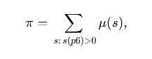

Estimating the result to be `0.2758421`, which is very, very close to the real one obtained, which is 
`0.31814921752052894`, that, considered the nature of the LLM, is extremely impressive to obtain.

#### Final thoughts:

GPT has shown extremely proficient capabilities in understanding what Model Checking is, what its properties are, how
to test theoretically, and even more how to test them in a practical software environment like PRISM. I suspect of all 
this has been doable thanks to the new `Search` and `Reason` capabilities given to the LLM, which, respectively, lets 
the LLM search on the web for the topic/s given in the prompt, and the second one gives more reasoning time to the LLM
in general to produce a better answer.


# 09Lab - Reinforcement Learning: from MDP to RL and Q-Learning, Deep Q-Learning, and MARL

## Task 1: BASIC-Q-LEARNING

* Get acquainted with the basic tool of Q-learning, focussing on examples/TryQLearningMatrix
* check how variation of key parameters (epsilon, gamma, alpha, episode length) affects learning
* check how learning gets more difficult as the grid size increases

## Work Done:

After checking that the basic example given inside 
[TryQLearningMatrix.scala](src/main/scala/u09/examples/TryQLearningMatrix.scala) works, I started to observer and
experiment with the parameters given, and how they affect the learning process of the Q-learning algorithm.
As per task, I experimented with the **epsilon**, **gamma**, **alpha** and **episode length** parameters.

* ### Epsilon:
The **epsilon** parameter controls the exploration-exploitation trade-off in the Q-learning algorithm. A higher epsilon 
value means exploration is encouraged, which is useful in the early stage of learning. A lower epsilon value means the 
agent favors exploitation of the learned policy. 

Here below we can see some of the experimentation done with the parameter, where initially I just used the base example
given and modified the parameter (Below side by side are outputs where epsilon was firstly = 0.3, as per default, 
and then = 0.9):

|  | 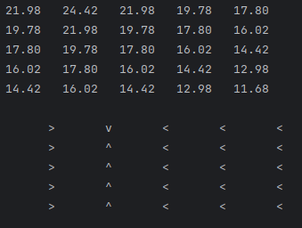 |
|-----------------------------------------------|-----------------------------------------------------|

As we can see, the results are the same, this maninly comes from the fact that the grid to explore is very small, as it
is of size 5x5, and, as a matter of fact, by just increasing the size to a 10x10, we can already see the effects of the
parameter below (re-using the same epsilon values as before):

|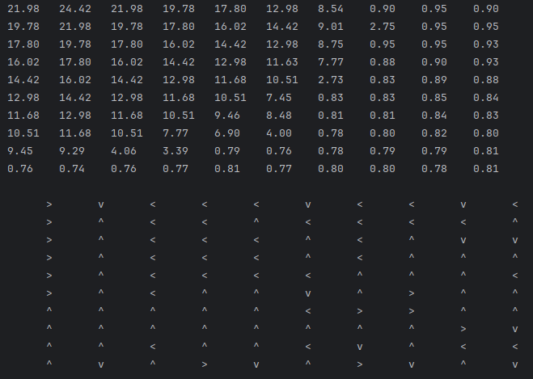 | 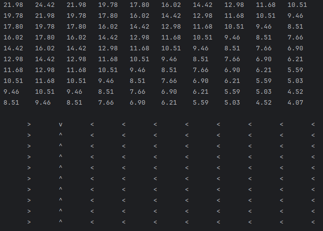  |
|-----------------------------------------------|-----------------------------------------------------|

It's very clear from the images, that the second one (with epsilon = 0.9) is much more exploratory, and the agent has 
fully locked in, in using the first jump, the one that has a larger reward, since it has better explored the environment,
meanwhile the second still struggles to properly navigate the environment, as it can be seen in the lower part of graph 
of the first image.

* ### Gamma:
The **gamma** parameter determines the discount factor for future rewards. A higher gamma value means the agent 
considers long term rewards more and prioritizes them, meanwhile is exactly the opposite for a lower gamma value,
meaning short term rewards are prioritized.

Again below, more experimentation has been done, firstly with the default setup, where in the first image the gamma
values was set to 0.9, as per default, and in the second to 0.1:

| 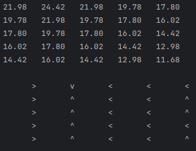 | 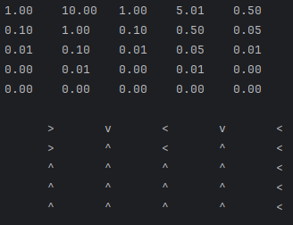 |
|----------------------------------------------|----------------------------------------------|

As we can see, the first image makes absolute use of the first jump, which is the one with the highest reward, meanwhile
the second image, with gamma = 0.1, is much shorter term oriented, and when available based on position, uses the second
jump more often, which is the one with the lower reward.

Further testing has been done with a larger grid, with the same gamma values per image, and also with the second jump 
moved further from the first, more precisely to the coordinate (6, 0), where the destination coordinates are (6, 7), to 
further illustrate the previously explained point, and the results are as follows:

| 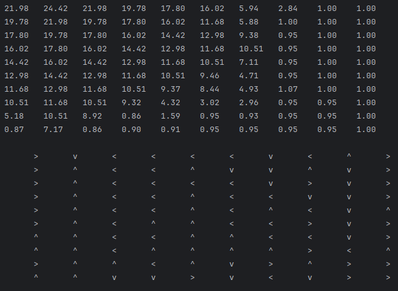| 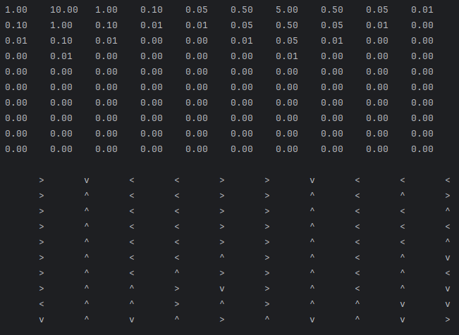 |
|----------------------------------------------|----------------------------------------------|

Once again, the previously stated observations can also be seen here.

* ### Alpha:
The **alpha** parameter determines the learning rate of the Q-learning algorithm. A higher alpha value means that 
faster updates to the Q-values are allowed, but it may lead to instability, meanwhile lower values result in slower
learning but more stable convergence.

Once again, the experiments below show the results of the alpha parameter, where in the first image the alpha value was 
set to 0.2, and then to 0.9, to show the convergence difference:

| 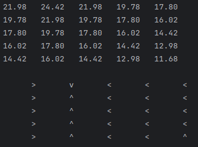 |  |
|----------------------------------------------|----------------------------------------------|

In the 5x5 grid, the difference is not noticeable unfortunately, but in the 10x10 grid, as shown below, the difference 
is more apparent, where, once again, the first image has alpha = 0.2, and the second one has alpha = 0.9, and the second
jump as been moved to the position (6, 0), landing in (6, 7) as before:

| 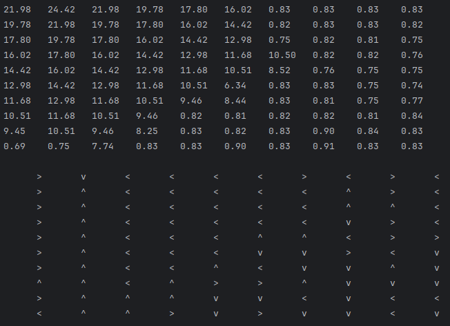 | 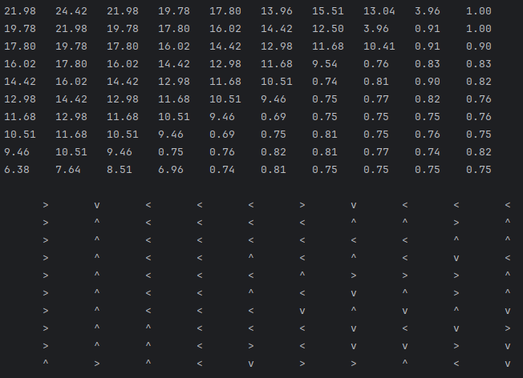 |
|----------------------------------------------|----------------------------------------------|

As we can see in the first image, the agent hasn't really recognized the second jump, because of the slow convergence, 
meanwhile in the second, having faster updates, the agent takes more advantage of the second jump in (6 ,0).

* ### Episode Length:
The **episode length** parameter determines the maximum number of steps allowed in each episode. A longer episode means
the agent is allowed to explore more of the environment, while a shorter episode may lead to premature convergence and 
limit learning in larger grids.

An example, once again, can be seen below, where the first image has the default episode length of 100, and the second 
one has been updated to 300:

| 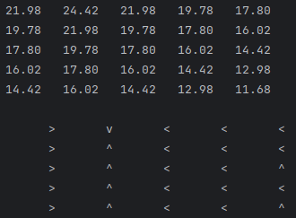 | 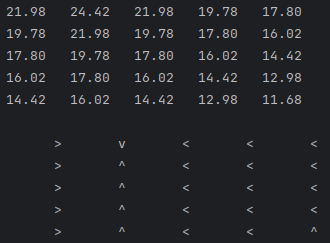 |
|----------------------------------------------|--------------------------------------------------------------|